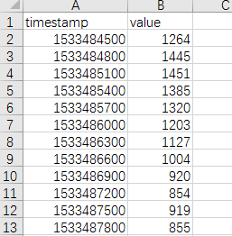

# Anomaly detection and Curve classification

(### Requirements)

-------

Python 3.5.2

see `requirements.txt` for necessary modules. 


(### Curve-classification)

--------

Put only data csvs and python files in this folder like following

+ `feature_method.py`
+ `curve_classify.py`
+ `_153_5_34_67336.csv`
+ ...

Data csvs should contain two columns, first is timestamp and second is value. The first row should labeled as 'timestamp' and 'value' like following:



#### Usage

```shell
cd <datafolder>
python curve_classify.py <cluster_num>
```

`cluster_num` should be specified, which decides how many clusters the curves will be classified into. 

After the run, we will have `features_csv, curve_model_KMeans.pkl, rforest_model.pkl `and several figures for classified curves, which are randomly picked from all the curves. 

+ `features_csv`: Contains all the calculated features. 

+ `curve_model_KMeans.pkl`: This is the saved model for classification. However, the features are multiplied with some weights defined in `curve_classify.py`, so it maybe inconvenient to transfer the model. 
+ `rforest_model.pkl`: This is a random forest model generated using the features without weights and the prediction made by KMeans. So for new curves to be classified, we can type `python classify_for_new.py <filename>` and the output will the class.  


(### Anomaly-Detection)

--------

Put the file to be detected in the same folder as the python files. 

The data.csv file should contain `timestamp`, `value`, and `is_anomaly`(optional). 

#### Usage

```shell
cd <datafolder>
python anomaly_detect.py data.csv 0 0.004
python anomaly_detect.py data.csv 1 0.004
```

0 means we do not have labels in data.csv and we will have unsupervised learning with Isolation Forest. 

1 means we have labels in data.csv and both unsupervised and supervised methods will be used. 

After the run, images will be generated. 

Because I did anomaly detection first, so I did not really specify what the input and output should be and if you want to make it be able to handle online data, you may need to reorganize the program code and extract the feature function like we did in curve classification. 


(### Combination)

-------

This is the a combination of classification and detection after some training on 1478 curves. 

Basically we take in a curve, do classification based on existing model and then use the corresponding detection method. 

The csv file should contain timestamp and value. 

#### Usage

```shell
cd <datafolder>
python final.py data.csv
```

After the run, we get a `data_anomaly.csv` and a figure of the anomaly. 

In `data_anomaly.csv` we have a `is_anomaly` column, 1 for anomaly and 0 for normal. 
